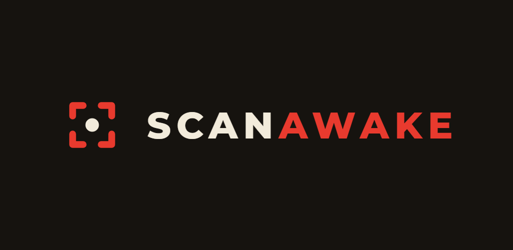

<p align="center">
  
</p>

# ScanAwake ⏰📷

**"Scan to wake. You actually have to get up."**

ScanAwake is an aggressive alarm app for people who struggle to wake up. A standard alarm is too easy to dismiss half-asleep — ScanAwake makes you *physically get out of bed*. To silence it you must scan a barcode/QR you pre-defined (toothpaste, a book in another room, the bathroom shampoo…), and — in v2.0 — then complete a real-world **wake-up task** before the alarm fully stops.

> Android-first. Turkish (TR) and English (EN). Fully offline — no accounts, no network, no secrets.

## ✨ What makes it different: the two-stage wake (v2.0)

Most "scan to dismiss" alarms stop the moment you scan. ScanAwake's core differentiator is that the barcode is only **stage one**:

1. **Stage 1 — Scan.** The alarm rings (full volume, looping, vibration, over the lock screen). The only way forward is to scan a pre-defined barcode with the camera.
2. **Audio hand-off.** Scanning does **not** end the alarm — it drops the sound to ~50% (a continued soft loop) so you can't just roll over.
3. **Stage 2 — Mission.** A real-world task appears. Only completing it fully silences the alarm and awards your streak.

This keeps you awake and moving instead of dismissing-and-dozing.

### Wake-up tasks (missions)

* **Lümen (Light)** — Point the phone at a bright light source (open the curtains, find a window) and hold it bright for a couple of seconds. Uses the camera's luminance, fully on-device.
* **Color hunt** — A slot machine picks a random color; show an object of that color to the camera (center-ROI HSV match, unlimited rerolls).
* **Object recognition (AI)** — Show a common household item (cup, plate, cutlery…); recognized on-device with a bundled ImageNet (EfficientNet-Lite0) TFLite classifier + concept grouping.
* **Water sound** — Run a tap; detected on-device with YAMNet audio classification. (During this task the alarm uses looping **vibration** instead of a soft audio loop, because the mic's audio focus would mute the loop.)

All five wake-up tasks are **live (v2.0)** and device-verified. Each alarm can be assigned its own task (or **none**, which behaves like the classic v1 scan-to-stop). Every progress mission uses a *leaky* hold bar (a brief miss decays it rather than hard-resetting).

## 🔥 Gamification

* **Streak** — a "fire" streak that grows each genuine wake-up, with a **1-day grace** (a single missed day is forgiven; two missed days break it). Anti-cheat: a *real* escape (backgrounding the app while it rings) resets streak **and** tokens for maximum deterrence; a crash, OEM kill, or reboot never punishes an honest streak. Test/snooze dismissals never earn a streak.
* **Snooze tokens** — a limited number of snoozes. Snoozing re-fires the same alarm **5 minutes** later, carrying the same wake-up task (so snooze can't be used to skip the mission).

## 🚀 Key features

* **Barcode/QR dismissal** — up to 3 saved dismissal codes, any format.
* **Fault-tolerant camera** — a custom "restart sequence" and single-camera release handling keep the camera reliable even on aggressive OEMs (Xiaomi/MIUI), where camera/vibration hardware contention is common.
* **Reliable lock-screen alarm** — full-screen intent, `showWhenLocked` / `turnScreenOn`, and lock-screen continuity *through the two-stage hand-off* (the mission stays visible over the keyguard, no unlock required).
* **Flexible scheduling** — one-shot and repeating (daily / weekdays / custom days), in-place editing.
* **Ringtones** — 9 built-in sounds plus a custom audio file, with preview.
* **TR/EN localization** and an OLED-friendly dark mode.

## 🛠️ Tech stack

Built with **Flutter / Dart 3**, stock `setState` (no extra state-management framework).

| Concern | Package |
|---|---|
| Full-screen looping alarms | `alarm` 5.1.5 |
| Barcode/QR scanning (ML Kit) | `mobile_scanner` 5.2.3 |
| Soft-loop audio hand-off & ringtone preview | `audioplayers` 6.5.1 |
| Camera frames (Lümen / Color / Object) | `camera` 0.12.0+1 |
| Object recognition (on-device, bundled model) | `google_mlkit_image_labeling` 0.14.2 |
| Water-sound classification (on-device YAMNet) | `tflite_flutter` 0.12.1 + `record` 6.2.1 |
| Mission vibration (Water task) | `vibration` 3.2.0 |
| Runtime permissions | `permission_handler` 11.4.0 |
| Local persistence | `shared_preferences` 2.5.4 |
| Custom ringtone picking | `file_picker` 8.3.7 |

> Full inventory (versions, licenses, ML models, update/security checklist): [DEPENDENCIES.md](DEPENDENCIES.md).

### Architecture

The codebase is modular — `constants / models / services / screens / l10n / missions` — fed by a tested core:

* `AlarmGateway` + `scheduleAlarmFn` — the single funnel for **all** scheduling (re-arm correctness, exact-alarm permission gate). Every dismiss path (success / snooze / restart / emergency) re-arms a repeating alarm and carries its wake-up task.
* Pluggable `Mission` contract — `RingScreen` renders the task after a successful scan; missions return success/failure.
* Hand-written `AlarmEntity` JSON; gamification + anti-cheat + streak-grace live in pure, unit-tested helpers.
* **177 tests**, `flutter analyze` clean, CI gate + branch protection on `main`.

## ⚙️ Setup

A **physical Android device is strongly recommended** — alarm, camera, vibration, full-screen and lock-screen behavior are not meaningfully testable on desktop/web.

```bash
flutter pub get
flutter run        # or: flutter run -d <deviceId>
```

### Android permissions (why they're needed)

* `SCHEDULE_EXACT_ALARM` / `USE_EXACT_ALARM` — fire on time.
* `USE_FULL_SCREEN_INTENT` + `showWhenLocked` / `turnScreenOn` + `WAKE_LOCK` — show the ringing/mission UI over the lock screen.
* `CAMERA` — barcode scanning and the camera-based tasks (Lümen / Color / Object).
* `RECORD_AUDIO` + foreground-service `microphone` — only during the Water-sound task; audio is classified on-device and never stored or transmitted.
* `RECEIVE_BOOT_COMPLETED`, `VIBRATE`, `POST_NOTIFICATIONS`, `FOREGROUND_SERVICE`.

> **Xiaomi / MIUI note:** for alarms to fire reliably from a locked screen or after reboot, also grant *Autostart* and *Show on lock screen* in MIUI app settings, and exempt the app from battery optimization.

## 🤝 Contributing

`main` is branch-protected — land changes via a feature branch + PR that passes CI (analyze + tests).

## 📝 License

Proprietary — © 2025-2026 Burak Çam, all rights reserved. See [LICENSE](LICENSE).
Bundled third-party components (YAMNet, ImageNet TFLite model, Flutter/Dart
packages) remain under their own licenses.

---
**Developer:** Burak Çam
**Status:** v2.0 (two-stage wake) shipped — all five wake-up tasks live and device-verified; now in Play Store preparation.
